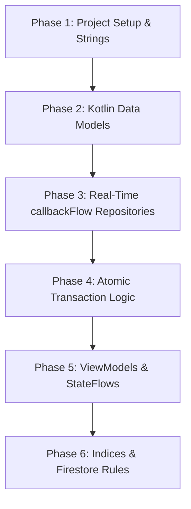

# BazaarLink Backend Implementation & Execution Plan

This plan outlines a highly reliable, robust, and clean MVVM architecture using Kotlin, Jetpack Compose, and Firebase (Auth + Firestore). It details every step from project initialization to real-time sync flows and localized resource setup.

---

## Phase 1: Project Initialization & Dependency Setup
*Goal: Generate a standard, stable Android project structure with declarative Jetpack Compose UI and official Firebase SDKs.*

1. **Folder & Build Structure:**
   * **Project-level `build.gradle.kts`**: Configure Android Gradle Plugin, Kotlin, and Google Services.
   * **App-level `build.gradle.kts`**: Configure target SDK (34+), Compose Compiler, and packaging.
   * **Dependencies**:
     * Firebase BOM (Bill of Materials) to avoid version mismatch.
     * Firebase Auth, Firebase Firestore (Kotlin Coroutines support via `firebase-firestore-ktx`).
     * Navigation Compose for typed/route-based MVVM navigation.
     * AndroidX Lifecycle and ViewModel-Compose.
2. **Localization & App Resource Base:**
   * Hardcode ZERO UI text. Create a comprehensive Urdu/English base in `res/values/strings.xml` (and `res/values-ur/strings.xml` later if needed).

---

## Phase 2: Strongly-Typed Firestore Data Models
*Goal: Model the domain data structures with exact JSON keys, robust mappings, and safe defaults.*

1. **`User` and `VendorProfile`:**
   * Maps to `/users/{userId}`.
   * `userId` bound via `@DocumentId` annotation.
   * Nullable `vendorProfile` to differentiate roles (BUYER vs VENDOR).
   * Vendor profile containing shop details and `connectsBalance` (initialized to 50 for MVP).
2. **`Request` and `Location`:**
   * Maps to `/requests/{requestId}`.
   * `requestId` bound via `@DocumentId`.
   * Tracks status: `BROADCASTING`, `ACCEPTED`, `EXPIRED`.
   * Holds coordinates and a simple location name (e.g., "Star City Mall").
3. **`Quote`:**
   * Maps to `/quotes/{quoteId}`.
   * `quoteId` bound via `@DocumentId`.
   * Stores denormalized shop metadata (e.g., `vendorShopName`, `vendorRating`) to prevent secondary read queries on the client side.

---

## Phase 3: Firebase Repositories & Real-Time Flow Streams
*Goal: Implement data-access layers using standard Kotlin Coroutine `Flow` streams wrapped around Firestore listeners.*

1. **`BazaarLinkRepository` Interface & Implementation (`BazaarLinkRepositoryImpl`):**
   * Avoid Dagger/Hilt complexity; use manual instantiations inside ViewModels or a custom Service Locator.
2. **Real-Time Subscription via `callbackFlow`:**
   * Wrap `db.collection("requests").addSnapshotListener` inside a Kotlin `callbackFlow` to pipe Firestore update events into a cold reactive Stream.
   * Handle `awaitClose { subscription.remove() }` to guarantee no memory leaks when screens are disposed.
3. **Reactive Query Pipelines:**
   * **For Vendors:** A stream of incoming requests matching vendor's categories or tags.
   * **For Buyers:** A stream of quotes submitted in response to their active `requestId`.

---

## Phase 4: Atomic Transactions & Business Logic
*Goal: Build the transactional accepting mechanism where multiple documents are updated simultaneously.*

1. **Accepting a Quote Transaction (`acceptQuote`):**
   * Acquire references to the target `Request`, target `Quote`, and the winning `Vendor`.
   * Check preconditions (e.g. Vendor has > 0 connects, Request is still broadcasting).
   * Run Firestore atomic transaction (`db.runTransaction`):
     1. Update Request status to `ACCEPTED`, and store `acceptedQuoteId` and `acceptedVendorId`.
     2. Update Quote status to `ACCEPTED`.
     3. Decrement winning Vendor's `connectsBalance` by 1.
   * Wrap this operation in a Kotlin `Result` block to cleanly handle success/failure on the UI.

---

## Phase 5: Simple ViewModels & Compose State Hoisting
*Goal: Bridge raw data flows to UI state cleanly using `StateFlow` and manual dependency resolution.*

1. **`AuthViewModel`**: Handles user registration/role assignment (BUYER vs VENDOR) and persistent login state.
2. **`BuyerViewModel`**: Handles request broadcasting (writing to Firestore) and collecting incoming quotes flow for their active request.
3. **`VendorViewModel`**: Collects broadcasting requests flow matching their registered categories, and handles quote formulation/submission.
4. **`ServiceLocator` / Manual Providers**: Keep a clean singleton instance of Firebase objects and repositories to be manually passed to ViewModel factories.

---

## Phase 6: Firestore Indexes & Rule Deployment
*Goal: Document indices and security measures to prevent database lockouts.*

1. **Indexes (`firestore.indexes.json`):**
   * Composite Index: `requests` -> `status` (Asc) + `category` (Asc) + `createdAt` (Desc).
   * Composite Index: `quotes` -> `requestId` (Asc) + `createdAt` (Asc).
2. **Security Rules (`firestore.rules`):**
   * Safe wildcard filters and check for authentication status via `request.auth != null`.

---

## Execution Workflow Matrix

